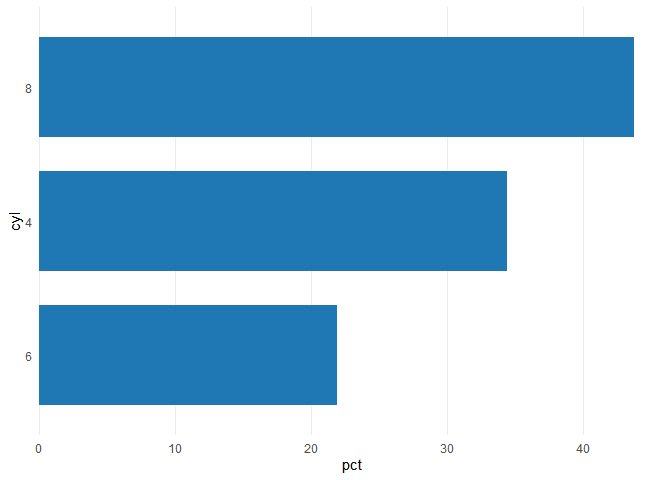
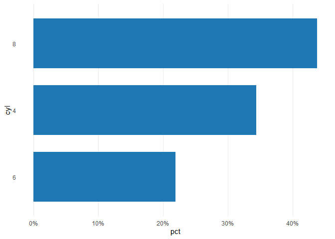
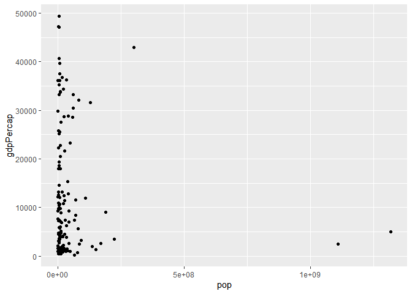
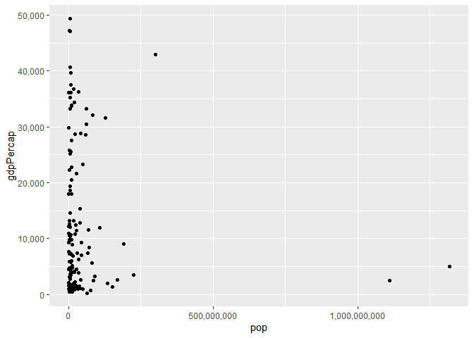
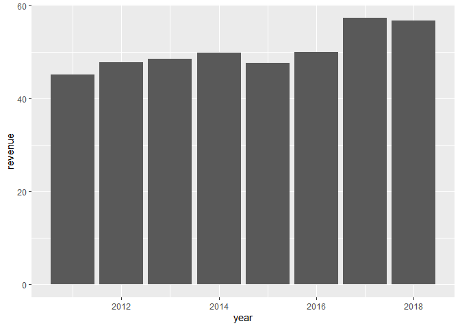
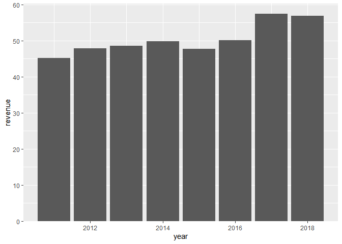

scalesextra
================

[](https://www.tidyverse.org/lifecycle/#experimental)

Overview
--------

`scalesextra` aims to make it a no brainer to customize `ggplot2` scales.

Installation
------------

The package is an a very early development stage and thus only available from GitHub.

``` r
if (!"remotes" %in% installed.packages()) {
  install.packages("remotes")
}
remotes::install_github("thomas-neitmann/scalesextra")
```

Usage
-----

``` r
library(dplyr)
library(ggcharts)
data(mtcars)

cyl <- mtcars %>%
  count(cyl) %>%
  mutate(pct = n / sum(n) * 100)

(p <- bar_chart(cyl, cyl, pct))
p + scalesextra::scale_y_pct()
```



``` r
library(gapminder)
data(gapminder)

(p <- gapminder %>%
  filter(year == 2007) %>%
  ggplot(aes(pop, gdpPercap)) +
  geom_point())
p + scalesextra::scale_x_pretty() + scalesextra::scale_y_pretty()
```



``` r
data(biomedicalrevenue)

(p <- biomedicalrevenue %>%
  filter(company == "Roche") %>%
  ggplot(aes(year, revenue)) +
  geom_col())
p + scalesextra::scale_y_tight()
```


